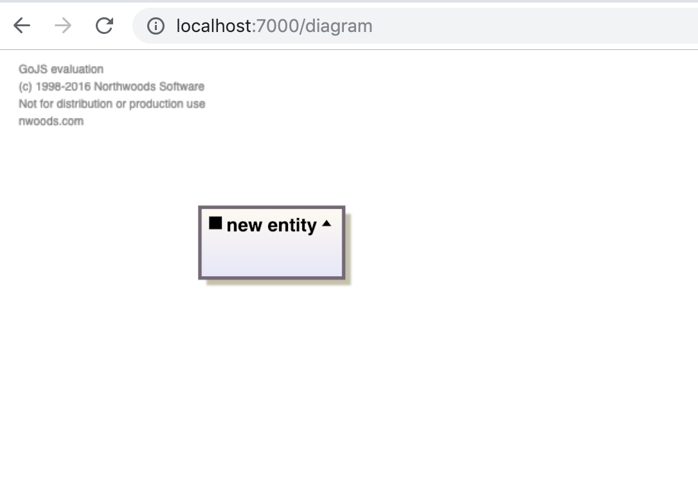
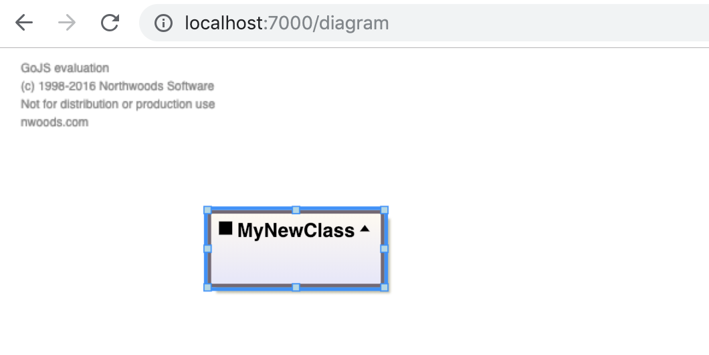
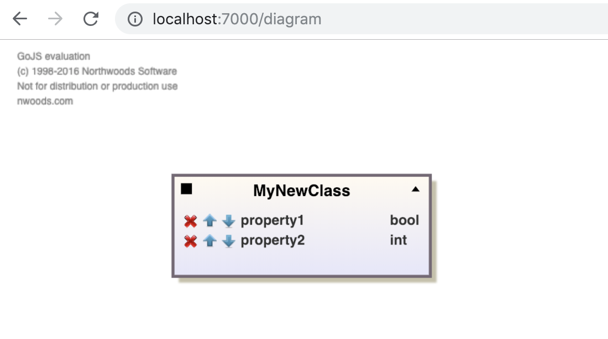
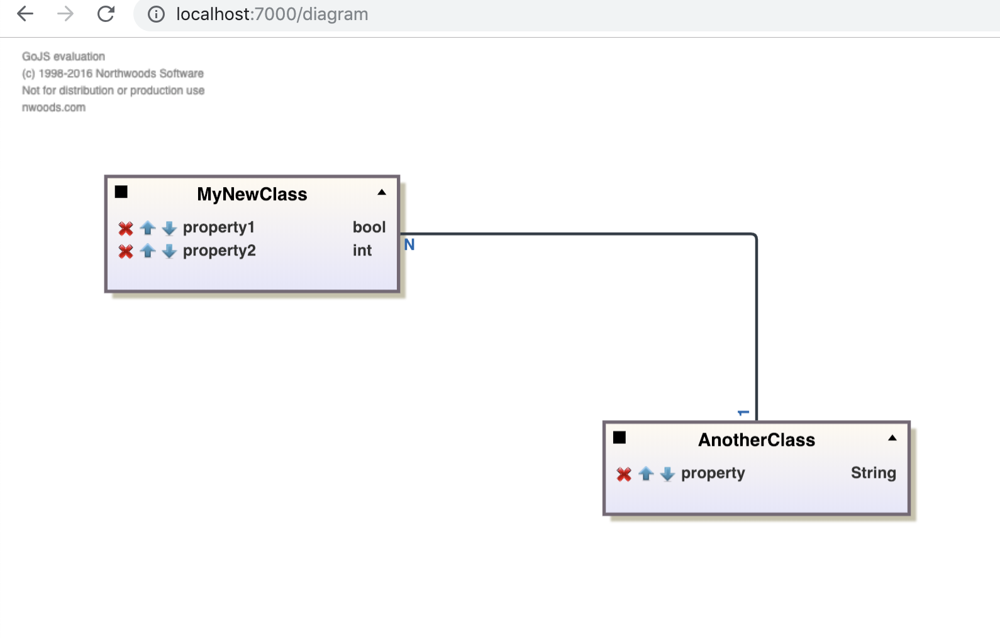

# Class Diagram Editor

This is a class diagram editor application where multiple users can create and edit a class diagram.

Java Spring Boot and jQuery are used for this project.

## Credits

In the UI part [**GoJS**](https://gojs.net/latest/index.html) library is used to draw class diagrams.

## Requirements and Instructions to Run

In this section, the requirements and instructions on how to run each component will be given.

### Server

The server has the following dependencies:

* Java 8 
* MongoDB

MongoDB must be started before running the server.

After installing those two dependencies, a compiled WAR file can be found in the root folder (file name is classDiagramEditor.war). It can be run by the following command:

```
java -jar /Server/classDiagramEditor.war
```

## Usage

* Go to **_http://localhost:7000/diagram_** on your browser

* If you use it first time, you need to enter credentials. There are two users that are automatically created, the first one has username = user1 and password = user1, and the second user has username = user2 and password = user2. This can be edited on ServerApplication.java file.

* An empty page will appear, you can do the following operations on that page:

    - Double-clicking on an empty place on the canvas will create a new box for a new class.

    	<p align="center"></p>
    
        - You can edit the title (class name) by double-clicking on the title.

        <p align="center"></p>
        
        - You can add new property for the class by double-clicking on an empty place on the box. Then, by clicking to the name or to the type of the property, you can edit them.

         <p align="center"></p>
        
        - Dragging a box onto another box will form a line between those two boxes. This can be used to define relations between classes. By default, a line presenting a 1-1 relationship will be created. This can be edited by clicking to the numbers appearing on the ends of the line.

        <p align="center"></p>
    
    - You can save the diagram by pressing Shift + 1. After that, the diagram will be persisted in DB so when another user will login, (s)he will see the same diagram on his/her browser and will be able to edit it.
